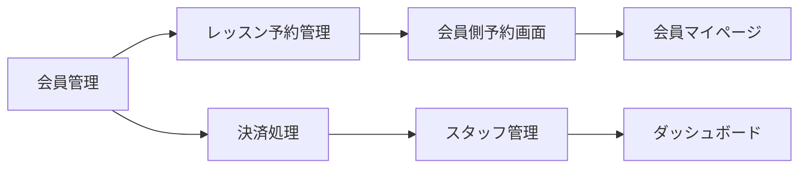

# 中核画面開発優先順位 / Core Screen Development Priority

## 概要 / Overview

ConnectEn SaaSプラットフォームの画面設計において、ダンススタジオ運営の中核となる機能から段階的に開発を進めるための優先順位を定義します。業務インパクトと利用頻度を基準に、最も重要な画面から着手することで、早期の価値提供を実現します。

This document defines the development priorities for the ConnectEn SaaS platform screen design, starting with core functions essential for dance studio operations. By prioritizing screens based on business impact and usage frequency, we aim to deliver value early in the development process.

---

## 🎯 フェーズ1: 最優先開発画面 / Phase 1: Highest Priority Screens

### 1. 会員管理画面 / Member Management Screens
**画面番号 / Screen Numbers**: 11-13

#### 優先度理由 / Priority Rationale
- すべての業務の基盤となる会員情報管理
- 収益管理の根幹を成す機能
- 他のすべての機能が会員データに依存

#### 主要機能 / Key Features
- **会員登録・編集** - 新規会員のオンボーディングと情報更新
- **会員ステータス管理** - アクティブ/休会/退会の状態管理
- **ファミリーアカウント連携** - 親子アカウントの紐付け（MindBody参考）
- **会員検索・フィルタリング** - 詳細検索と一括操作機能
- **ブラックリスト管理** - 問題のある会員の管理

#### ビジネスインパクト / Business Impact
- **収益への直接影響**: 会員数 × 月謝 = 基本収益
- **運営効率**: 正確な会員管理による業務効率化
- **データ基盤**: マーケティング分析の基礎データ

---

### 2. レッスン予約管理画面 / Lesson Reservation Management Screen
**画面番号 / Screen Number**: 18

#### 優先度理由 / Priority Rationale
- 日々の運営で最も使用頻度が高い
- スタジオ稼働率に直接影響
- 会員満足度を左右する重要機能

#### 主要機能 / Key Features
- **予約受付・確認** - リアルタイムの予約処理
- **キャンセル・変更処理** - 柔軟な予約変更対応
- **ウェイティングリスト管理** - キャンセル待ちの自動繰り上げ
- **マルチスタジオ対応** - 複数拠点の統合予約管理
- **定員管理** - レッスン毎の適切な人数管理

#### ビジネスインパクト / Business Impact
- **稼働率最大化**: 空きスロットの最小化
- **顧客満足度**: スムーズな予約体験の提供
- **運営効率**: 自動化による受付業務削減

---

### 3. 決済処理画面 / Payment Processing Screens
**画面番号 / Screen Numbers**: 20-21

#### 優先度理由 / Priority Rationale
- 収益管理の要となる機能
- キャッシュフロー管理に直結
- 決済トラブルは信頼性に大きく影響

#### 主要機能 / Key Features
- **月謝自動引き落とし** - 定期的な自動決済処理
- **マルチ決済対応** - クレジットカード(GMO/Stripe)、口座振替(JACS)、店頭決済
- **エリア別決済設定** - 渋谷/横浜(JACS)と群馬/栃木(群馬銀行)の使い分け
- **自動フェイルオーバー** - 決済失敗時の代替手段への自動切り替え
- **決済履歴管理** - 支払い状況の追跡と管理

#### ビジネスインパクト / Business Impact
- **収益安定化**: 確実な月謝回収
- **キャッシュフロー改善**: 支払い遅延の最小化
- **信頼性向上**: 安全で確実な決済処理

---

### 4. スタッフ・インストラクター管理画面 / Staff & Instructor Management Screens
**画面番号 / Screen Numbers**: 9-10

#### 優先度理由 / Priority Rationale
- 人材リソースの効率的な配置
- 人件費の適切な管理
- サービス品質の維持

#### 主要機能 / Key Features
- **統合人材マスタ** - スタッフとインストラクターの一元管理
- **シフト管理** - 効率的な人員配置
- **講師アサイン** - レッスンへの適切な講師割り当て
- **報酬計算** - レッスン数・生徒数に基づく自動計算
- **講師マイページ** - 講師専用の情報管理

#### ビジネスインパクト / Business Impact
- **コスト最適化**: 適切な人員配置による人件費管理
- **サービス品質**: 適材適所の講師アサイン
- **講師満足度**: 透明性のある報酬管理

---

### 5. ダッシュボード画面 / Dashboard Screen
**画面番号 / Screen Number**: 3

#### 優先度理由 / Priority Rationale
- 経営状況の即時把握
- 意思決定の迅速化
- 問題の早期発見

#### 主要機能 / Key Features
- **リアルタイムKPI表示** - 売上・会員数・稼働率
- **重要通知表示** - 緊急対応が必要な事項
- **クイックアクセスメニュー** - 頻繁に使用する機能への素早いアクセス
- **前年同期比較** - 成長率の可視化
- **マルチテナント対応** - 複数スタジオの統合表示

#### ビジネスインパクト / Business Impact
- **意思決定支援**: データに基づく経営判断
- **問題早期発見**: KPIの異常値検知
- **業務効率化**: 重要情報への素早いアクセス

---

## 📱 フェーズ2: 会員側必須画面 / Phase 2: Essential Member Screens

### 6. 会員側レッスン予約画面 / Member Lesson Reservation Screens
**画面番号 / Screen Numbers**: 54-56

#### 優先度理由 / Priority Rationale
- 会員の利用頻度が最も高い機能
- オンライン予約による運営効率化
- 会員満足度に直結

#### 主要機能 / Key Features
- **レッスン検索・表示** - スタジオ/日時/インストラクターでの検索
- **予約確認・確定** - 簡単な予約フロー
- **QRコード表示** - 受付時の本人確認用
- **キャンセル処理** - セルフサービスでのキャンセル
- **オンラインレッスン対応** - リモート参加の選択

#### ビジネスインパクト / Business Impact
- **会員満足度向上**: 24時間予約可能
- **受付業務削減**: セルフサービス化
- **稼働率向上**: リアルタイムの空き状況表示

---

### 7. 会員マイページ / Member My Page
**画面番号 / Screen Number**: 53

#### 優先度理由 / Priority Rationale
- 会員セルフサービスの基盤
- 運営側の問い合わせ対応削減
- 会員エンゲージメント向上

#### 主要機能 / Key Features
- **個人情報管理** - プロフィール編集
- **予約履歴表示** - 過去と今後の予約確認
- **ポイント残高確認** - Enポイントの管理
- **支払い履歴** - 月謝・購入履歴の確認
- **通知設定** - メール・プッシュ通知の管理

#### ビジネスインパクト / Business Impact
- **運営効率化**: 問い合わせ件数削減
- **会員満足度**: 情報の透明性確保
- **エンゲージメント向上**: 定期的なアクセス促進

---

## 📊 開発アプローチ / Development Approach

### 推奨開発順序 / Recommended Development Sequence

### 並行開発の推奨 / Parallel Development Recommendations

1. **バックエンド優先グループ**
   - 会員管理（基盤データ）
   - 決済処理（収益管理）
   - スタッフ管理（リソース管理）

2. **フロントエンド優先グループ**
   - レッスン予約管理
   - 会員側予約画面
   - ダッシュボード

### マイルストーン設定 / Milestone Setting

| フェーズ | 期間目安 | 完成画面 | 達成目標 |
|---------|---------|---------|----------|
| Phase 1-A | 2ヶ月 | 会員管理、決済処理 | 基本的な会員登録と月謝管理が可能 |
| Phase 1-B | 2ヶ月 | レッスン予約、スタッフ管理 | レッスン運営の基本機能完成 |
| Phase 1-C | 1ヶ月 | ダッシュボード | 経営状況の可視化 |
| Phase 2 | 2ヶ月 | 会員側画面 | 会員のセルフサービス実現 |

---

## ✅ 成功指標 / Success Metrics

### 定量的指標 / Quantitative Metrics
- **会員管理**: 1000件/分の会員データ処理能力
- **予約処理**: 同時100件の予約処理対応
- **決済成功率**: 99.9%以上の決済成功率
- **画面応答時間**: 2秒以内のレスポンス

### 定性的指標 / Qualitative Metrics
- **ユーザビリティ**: 直感的で学習コスト最小
- **信頼性**: 決済・予約の確実な処理
- **拡張性**: 将来機能追加が容易な設計
- **マルチテナント対応**: 複数スタジオの完全分離

---

## 📝 注意事項 / Important Notes

### 技術的考慮事項 / Technical Considerations
- **マルチテナント設計**: 最初から複数テナント対応を前提
- **API設計**: RESTful APIによる疎結合設計
- **セキュリティ**: 特に決済情報は PCI DSS 準拠
- **パフォーマンス**: 高負荷時（イベント時）の対応

### ビジネス的考慮事項 / Business Considerations
- **段階的リリース**: MVPから順次機能追加
- **ユーザーフィードバック**: 各フェーズ後の改善サイクル
- **移行計画**: 既存システムからのデータ移行
- **トレーニング**: スタッフ向け操作研修の計画

---

## 🔄 更新履歴 / Update History

| 日付 | バージョン | 更新内容 | 更新者 |
|------|------------|----------|--------|
| 2024-11-27 | 1.0 | 初版作成 | System |

---

## 📚 関連ドキュメント / Related Documents

- [ConnectEn_SaaS_統合機能一覧.csv](../feature_lists/ConnectEn_SaaS_統合機能一覧.csv)
- [画面一覧表-Screen_List.csv](./画面一覧表-Screen_List.csv)
- [システム概要設計書-System_Design_Overview.md](./システム概要設計書-System_Design_Overview.md)
- [フェーズ1実装計画-Phase1_Implementation_Plan.md](./フェーズ1実装計画-Phase1_Implementation_Plan.md)